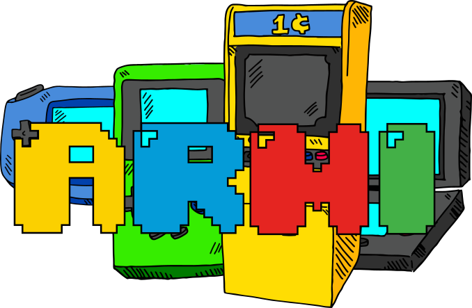

# Arcade Rom Management Interface

[](https://www.gnu.org/licenses/gpl-3.0)


[](https://beerpay.io/RetroTheArcadian/ARMI)

- Store your complete collection one place and deploy only what you play on the different devices
- Easy management of your collection
- Import/Export Emulation Station gamelist.xml files
- Import/export AttractMode emulator/gamelist files
- Basic scraper to improve metadata or find art
- Sync folders using filesystem, SFTP or Samba methods

## Installation

> Dowload a build below or clone this repository and build the solution yourself.
- Windows x64
- Windows x86
- Linux x64
- macOS x64

> You can use SQLite or Microsoft SQL Server for ARMI.

Edit **"appsettings.json"**
SqlLite
```json
"ConnectionType": "SqlLite"
```
Microsoft SQL Server
```json
"ConnectionType": "Sql"
```


### Setup
- Clone this repo to your local machine using `https://github.com/RetroTheArcadian/ARMI.git`

> now install npm packages

```shell
$ npm install
```

Finally build the solution in Visual Studio or other IDE which supports .NET Core.

---

## Contributing

- 🍴 Fork the project
- 👯 Clone this repo to your local machine using `https://github.com/RetroTheArcadian/ARMI.git`
- Create an upstream remote and sync your local copy before you branch.
- Branch for each separate piece of work.
- **HACK AWAY!** 🔨🔨🔨
- Write good commit messages.
- Push to your origin repository.
- 🔃 Create a new pull request using <a href="https://github.com/RetroTheArcadian/ARMI/compare/" target="_blank">`https://github.com/RetroTheArcadian/ARMI/compare/`</a>.
---

## Contributors

| <a href="http://github.com/RetroTheArcadian" target="_blank">**RetroTheArcadian**</a> | <a href="http://github.com/RetroTheArcadian" target="_blank">**Your name**</a>
| :---: |:---:|
|  | 
| <a href="http://github.com/RetroTheArcadian" target="_blank">`github`</a> | <a href="http://github.com/RetroTheArcadian" target="_blank">`github`</a>|

---

## FAQ
>This
- **How do I...?**
    - No problem! Just ask.

---

## Support

Create an issue here on github

---

## Donations (Optional)
No donations required. 
This is project a hobby project free for all.

If you love **ARMI** you can buy me a [🍺](https://beerpay.io/RetroTheArcadian/ARMI)
## License

[](https://www.gnu.org/licenses/gpl-3.0)

- **[GNU General Public License v3.0](https://github.com/RetroTheArcadian/ARMI/blob/master/LICENSE)**
- Copyright 1982 © <a href="http://github.com/RetroTheArcadian" target="_blank">RetroTheArcadian</a>.
